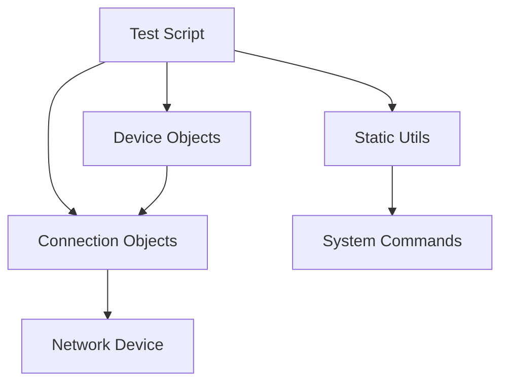

# API Reference

Welcome to the Router Test Kit API documentation. This section provides comprehensive documentation for all modules, classes, and functions in the router-test-kit framework.

## Overview

The Router Test Kit is organized into several core modules:

- **[Connection](connection.md)** - Network connection management (SSH and Telnet)
- **[Device](device.md)** - Device abstraction and management
- **[Static Utils](static_utils.md)** - Utility functions and helpers

## Architecture

The framework follows a clean separation of concerns:



### Design Principles

1. **Security First**: Modern SSH connections are preferred over legacy Telnet
2. **Type Safety**: Comprehensive type hints for better IDE support and error prevention
3. **Error Handling**: Robust error handling with informative exception messages
4. **Testability**: Extensive unit test coverage with mocking support
5. **Documentation**: Comprehensive docstrings following Google style

## Quick Start

Here's a basic example of using the API:

```python
from router_test_kit.connection import SSHConnection
from router_test_kit.device import LinuxDevice
from router_test_kit.static_utils import ping, get_packet_loss

# Create device and connection
device = LinuxDevice(username="admin", password="password")
conn = SSHConnection(timeout=30)

# Connect and execute commands
conn.connect(device, "192.168.1.1")
result = conn.write_command("show version")
conn.disconnect()

# Network utilities
ping_result = ping("8.8.8.8", count=3)
packet_loss = get_packet_loss(ping_result)
```

## Security Notice

!!! warning "Telnet Deprecation"
    The TelnetConnection class is deprecated due to security concerns. Telnet transmits data in plain text, making it vulnerable to eavesdropping and man-in-the-middle attacks. 
    
    **All new implementations should use SSHConnection for secure communications.**
    
    Telnet support will be removed in a future major version.

## Migration Guide

If you're currently using TelnetConnection, migrating to SSHConnection is straightforward:

```python
# Old (deprecated)
from router_test_kit.connection import TelnetConnection
conn = TelnetConnection()

# New (recommended)  
from router_test_kit.connection import SSHConnection
conn = SSHConnection()

# The API is identical for connect(), disconnect(), and write_command()
```

## Support

For questions, issues, or contributions, please visit the [GitHub repository](https://github.com/alex-anast/router-test-kit).
