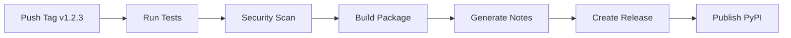

# Release Process

This document describes the automated release process for Router Test Kit.

## Overview

Router Test Kit uses an automated release pipeline that:
- 🏷️ Triggers on version tags (e.g., `v0.2.0`)
- 📝 Generates release notes from git history
- 📦 Builds and publishes to PyPI
- 🎉 Creates GitHub releases
- 📋 Updates changelog automatically

## Quick Release

To create a new release:

1. **Update Version** in `pyproject.toml`:
   ```toml
   [project]
   version = "0.3.0"  # Bump version
   ```

2. **Commit Changes**:
   ```bash
   git add pyproject.toml
   git commit -m "feat: bump version to 0.3.0"
   git push origin main
   ```

3. **Create and Push Tag**:
   ```bash
   git tag v0.3.0
   git push origin v0.3.0
   ```

4. **Automation Handles the Rest** 🚀
   - GitHub Actions will automatically:
     - Run all tests and checks
     - Build the package
     - Generate release notes
     - Create GitHub release
     - Publish to PyPI

## Detailed Process

### 1. Version Management

The project follows [Semantic Versioning](https://semver.org/):

- **MAJOR** (1.0.0): Breaking changes
- **MINOR** (0.1.0): New features (backwards compatible)
- **PATCH** (0.0.1): Bug fixes (backwards compatible)

**Examples:**
- `0.1.0` → `0.2.0`: New plugin system (minor)
- `0.2.0` → `0.2.1`: Bug fix (patch)
- `0.2.1` → `1.0.0`: Breaking API change (major)

### 2. Pre-Release Checklist

Before creating a release:

- [ ] All tests pass locally: `python -m pytest`
- [ ] Code coverage is adequate: `python -m pytest --cov`
- [ ] Documentation is updated
- [ ] Version number is bumped in `pyproject.toml`
- [ ] Notable changes are ready for changelog

### 3. Automated Workflow

When you push a version tag, the CI/CD pipeline:



#### Workflow Steps:

1. **Validation**:
   - Verify tag format (`v1.2.3`)
   - Check version matches `pyproject.toml`
   - Run full test suite
   - Perform security scanning

2. **Build**:
   - Create source distribution (`.tar.gz`)
   - Create wheel distribution (`.whl`)
   - Verify package contents

3. **Release Notes**:
   - Parse git history since last tag
   - Categorize commits by type
   - Generate formatted release notes

4. **Publish**:
   - Create GitHub release with notes
   - Upload package artifacts
   - Publish to PyPI with trusted publishing

### 4. Manual Release (Emergency)

If automation fails, you can release manually:

```bash
# Build package
python -m pip install build
python -m build

# Check package
python -m pip install twine
python -m twine check dist/*

# Upload to PyPI (requires API token)
python -m twine upload dist/*
```

## Configuration

### GitHub Secrets

Required secrets for automated releases:

- `PYPI_API_TOKEN`: PyPI trusted publishing token
- `GITHUB_TOKEN`: Automatically provided by GitHub

### PyPI Configuration

The project uses [PyPI Trusted Publishing](https://docs.pypi.org/trusted-publishers/) for secure, token-less publishing.

**Setup:**
1. Go to PyPI project settings
2. Add GitHub as trusted publisher
3. Configure repository details

## Release Notes

Release notes are automatically generated from git commits using these patterns:

| Commit Pattern | Category | Example |
|---------------|----------|---------|
| `feat:`, `add:` | ✨ New Features | `feat: add plugin system` |
| `fix:`, `bug:` | 🐛 Bug Fixes | `fix: connection timeout` |
| `docs:`, `doc:` | 📚 Documentation | `docs: update API guide` |
| `test:`, `tests:` | 🧪 Testing | `test: add unit tests` |
| `ci:`, `cd:` | ⚙️ CI/CD | `ci: improve workflow` |
| Others | 🔧 Other Changes | `refactor: cleanup code` |

**Best Practices:**
- Use descriptive commit messages
- Start with action verb
- Keep first line under 50 characters
- Reference issues when applicable

## Troubleshooting

### Common Issues

**1. Version Mismatch Error**
```
Error: Version mismatch between tag (1.2.3) and pyproject.toml (1.2.2)
```
**Solution:** Update version in `pyproject.toml` before tagging.

**2. PyPI Upload Fails**
```
ERROR: File already exists
```
**Solution:** Versions cannot be re-uploaded. Bump version and re-tag.

**3. Tests Fail on Release**
```
FAILED tests/test_module.py::test_function
```
**Solution:** Fix tests before tagging. All tests must pass.

### Rollback Process

If a release has issues:

1. **Mark Release as Draft** (GitHub)
2. **Yank Package** (PyPI if necessary):
   ```bash
   pip install twine
   twine upload --repository pypi --skip-existing dist/*
   ```
3. **Fix Issues** and create new release

## Monitoring

After release, monitor:

- [GitHub Release Page](https://github.com/alex-anast/router-test-kit/releases)
- [PyPI Package Page](https://pypi.org/project/router-test-kit/)
- [GitHub Actions](https://github.com/alex-anast/router-test-kit/actions)
- Download statistics and user feedback

## Security

Release process security measures:

- ✅ Automated security scanning with Bandit
- ✅ Dependency vulnerability checking
- ✅ Trusted publishing (no API tokens in workflows)
- ✅ Signed releases with GitHub
- ✅ Reproducible builds

---

## Quick Reference

```bash
# Check current version
grep version pyproject.toml

# Create release
vim pyproject.toml  # Update version
git add pyproject.toml
git commit -m "feat: bump version to X.Y.Z"
git tag vX.Y.Z
git push origin main vX.Y.Z

# Monitor release
open https://github.com/alex-anast/router-test-kit/actions
```

For questions or issues with releases, [open an issue](https://github.com/alex-anast/router-test-kit/issues) or contact the maintainers.
